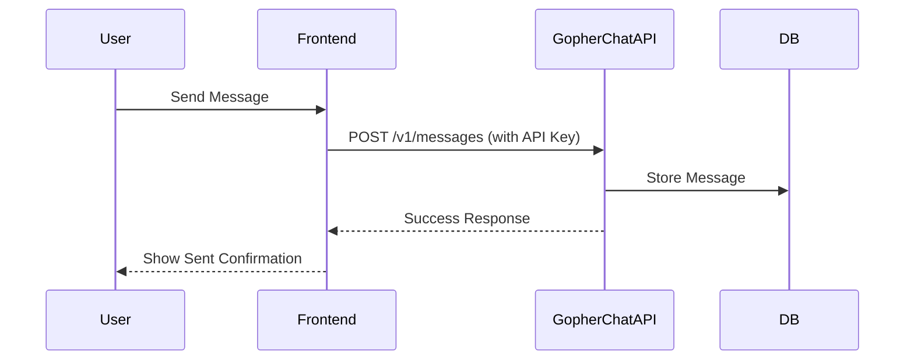

# Gopher Chat

Gopher Chat is a modern, scalable chat server written in Go, designed for fast and secure messaging with a clean API-first architecture.

---

## 🚀 Features

- **API-First Design**: RESTful endpoints for chat operations.
- **Modular Go Architecture**: Clean separation of API, DB, and business logic.
- **Automatic Database Migrations**: Schema managed at startup.
- **Centralized Configuration**: Easy deployment and tuning.
- **API Key Security**: Protects sensitive endpoints.
- **OpenAPI (Swagger) Docs**: Self-describing API.

---

## 📚 Architecture Overview

```mermaid
graph TD
    A[Client (Web/Mobile)] -->|HTTP/REST| B(API Layer)
    B -->|Business Logic| C(Storage Layer)
    C -->|SQL| D[(Database)]
    B --> E[Config Loader]
    C --> F[Migrations]
```

---

## 🖼️ Example Request Flow



---

*(Continue with the rest of your README as before)*

---

<sub>
For more on Mermaid diagrams in GitHub READMEs, see [GitHub Docs: Creating diagrams](https://docs.github.com/get-started/writing-on-github/working-with-advanced-formatting/creating-diagrams#creating-mermaid-diagrams)
</sub>
